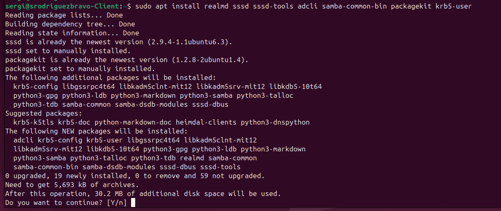
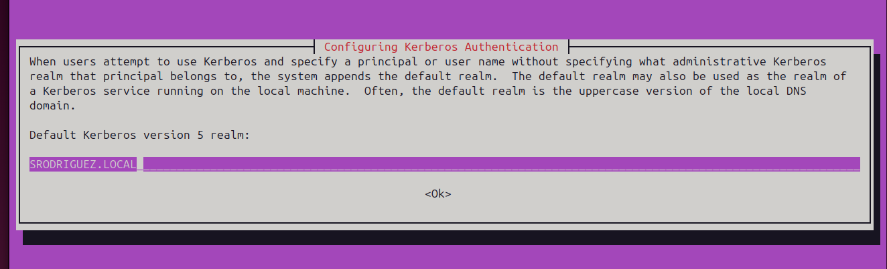
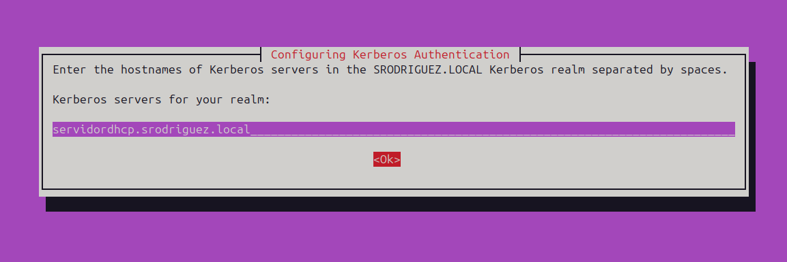
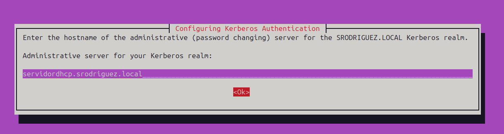
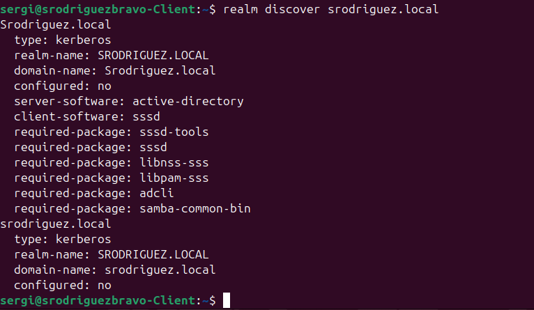
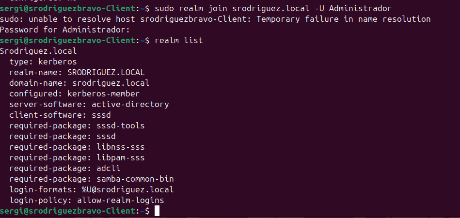
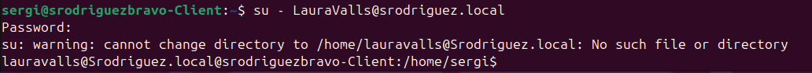
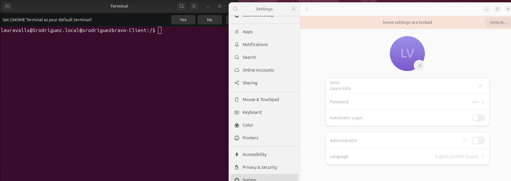

# 🪟 🐧Exercici 2: Repte de conexió a Active Directory:
---
## 🏢🪟 A partir d'un client Linux amb Ubuntu 24.04, connectat a l'Active Directory que has creat al Windows server 2019:
---
### 1. Instalar els paquets necessaris:
*Instalarem els paquets necessaris que són:* **realmd, sssd, sssd-tools, adcli, samba-common-bin, package-git i krb5-user**

*Una vegada s'han instalat alguns paquets ens apreixara una finestra de la configuració del kerberos.*

*En la finestra el primer que ens demanara és especificar el domini al que ens volem connectar "ha d'estar tot en majuscules encara que el domini sigui en minuscules".*

*En el següent pas et demana indicar el "**hostname**" de kerberos del servidor SRODRIGUEZ.LOCAL separat per espais, és ha dir has d'indicar el "**nomservidor.nomdomini.local**".*

*En el següent pas et demana indicar el hostname de l'administrador del servidor SRODRIGUEZ.LOCAL.* *,és ha dir has d'indicar el nom del servidor "**hostname**" seguit del domini. "servidordhcp.srodriguez.local".*

---
### 2. Verificar que el client pot veure el servidor:

### 3. Connectar el client linux a un usuari del servidor:

**Unir el client al domini:**

**Conectarse a un usuari del Domini:**

**Verificació:**

