# Configuració de xarxes i seguretat:
## Excercici 1: Comprovacio de les comandes 

## A. Diagnòstic i Informació:

### Ipconfig /all:

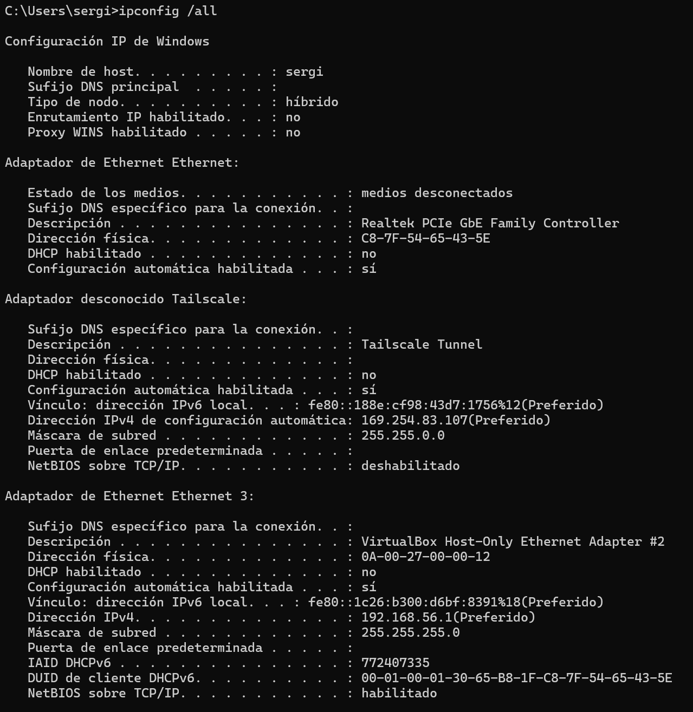

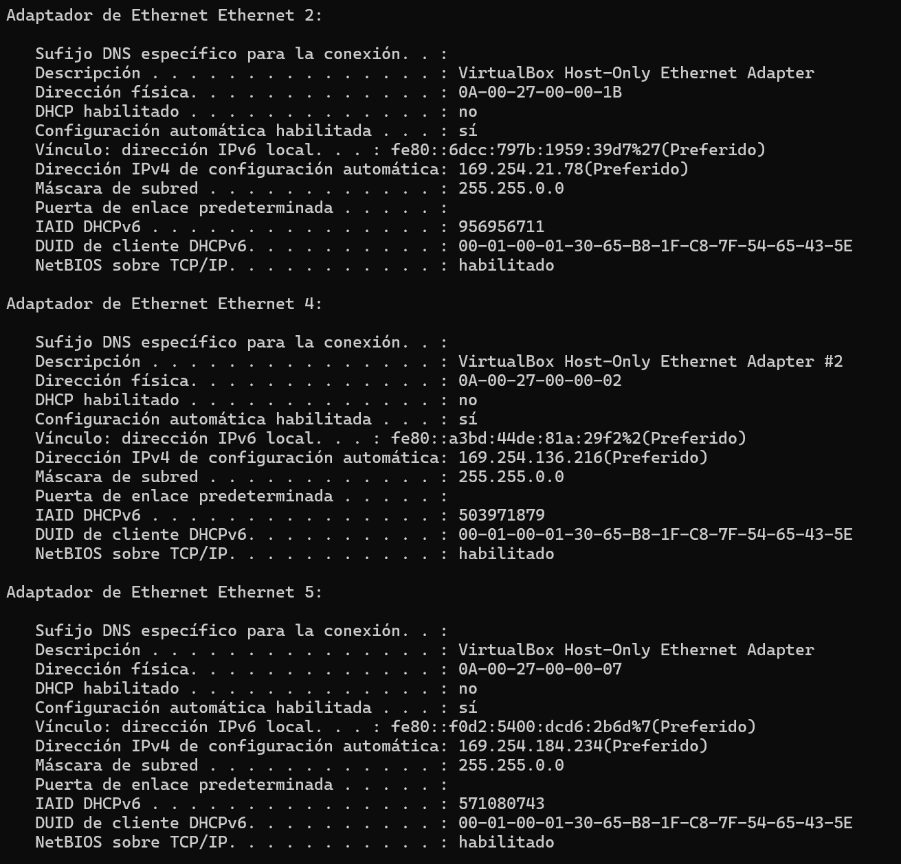

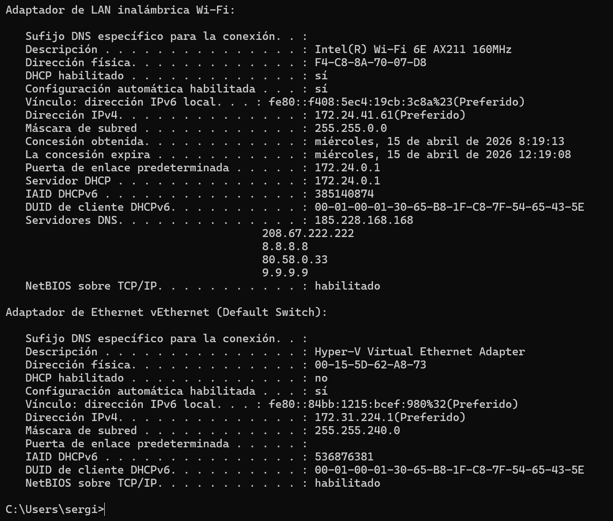


### Ping:

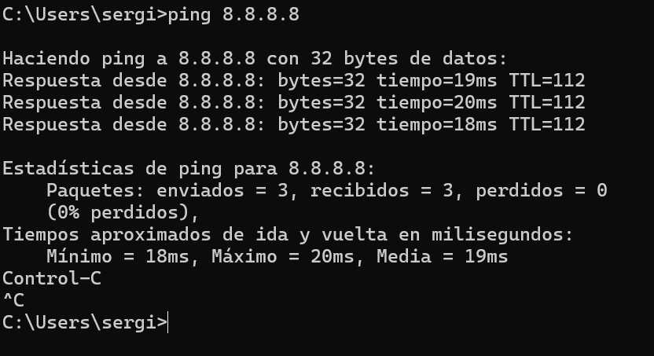


### tracert:

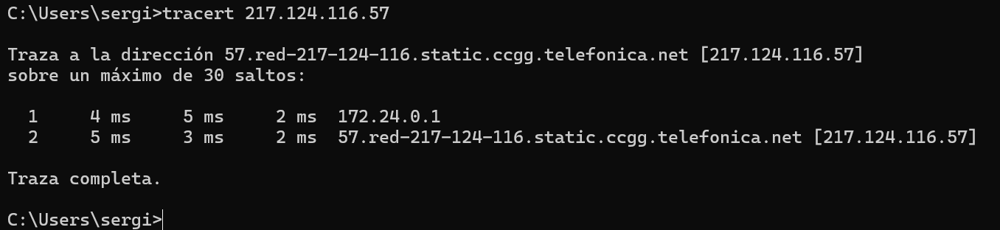


### Route print:

El primer que veiem amb route print es `lista de interfaces` que et mostra totes les tarjetes/adaptadors de xarxa que existeixen en el teu ordinador tant:

- [ ] Físiques
- [ ] Virtuals
- [ ] VPN
- [ ] Virtualització.

Cada línea és divideix aixi:
```
 3...c8 7f 54 65 43 5e ......Realtek PCIe GbE Family Controller
```
`3` -> ID de l'interfaç.

`c8 7f 54 65 43 5e` -> Direcció mac

`Realtek PCIe GbE Family Cotroller` -> Nom de l'adaptador.


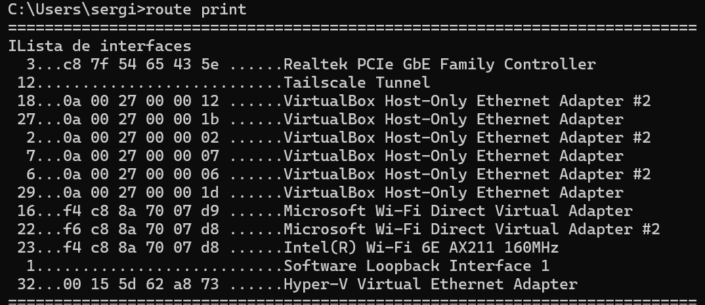


Route print veiem la taula d'enrutament que cada linea correspont a lo següent: La primera línea Destino de red  indica la xarxa o ip de destí a la que vols arribar. 

La líniea Máscara de red indica la mascara de la xarxa.

La línea Puerta de enlace indica el següyent salt o router al que ha d'enviar el trafic.

La línea Interfaz indica la IP local del teu ordinador utilitzada per soritr, i per últim la línea Métrica indica la prioritat /cost de la ruta (més baixa = millor).

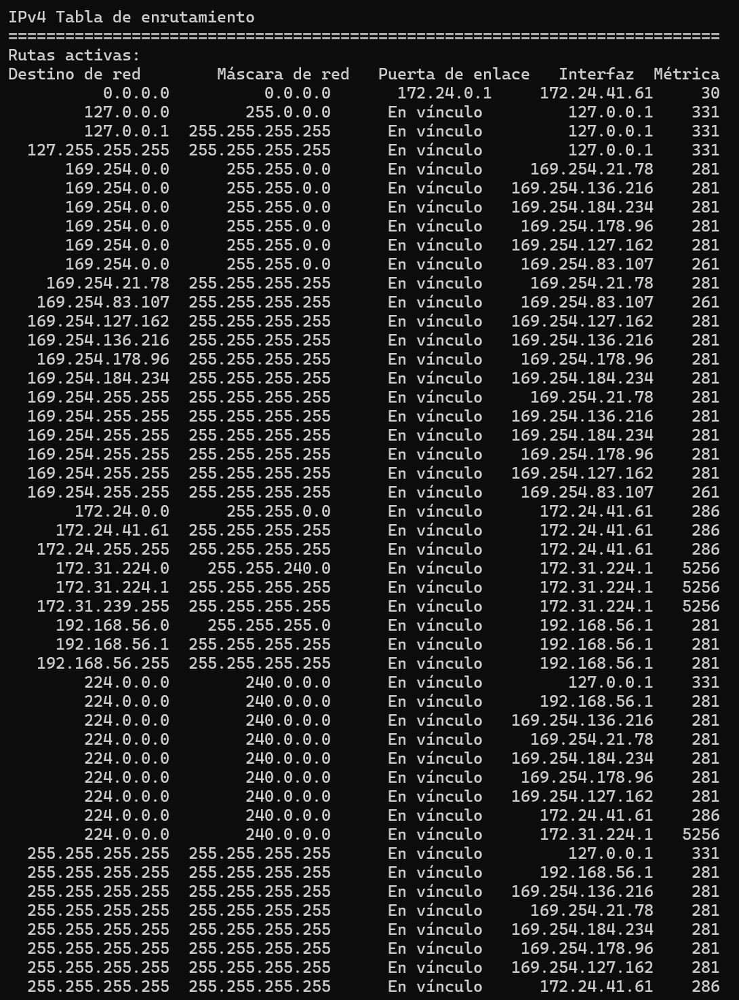


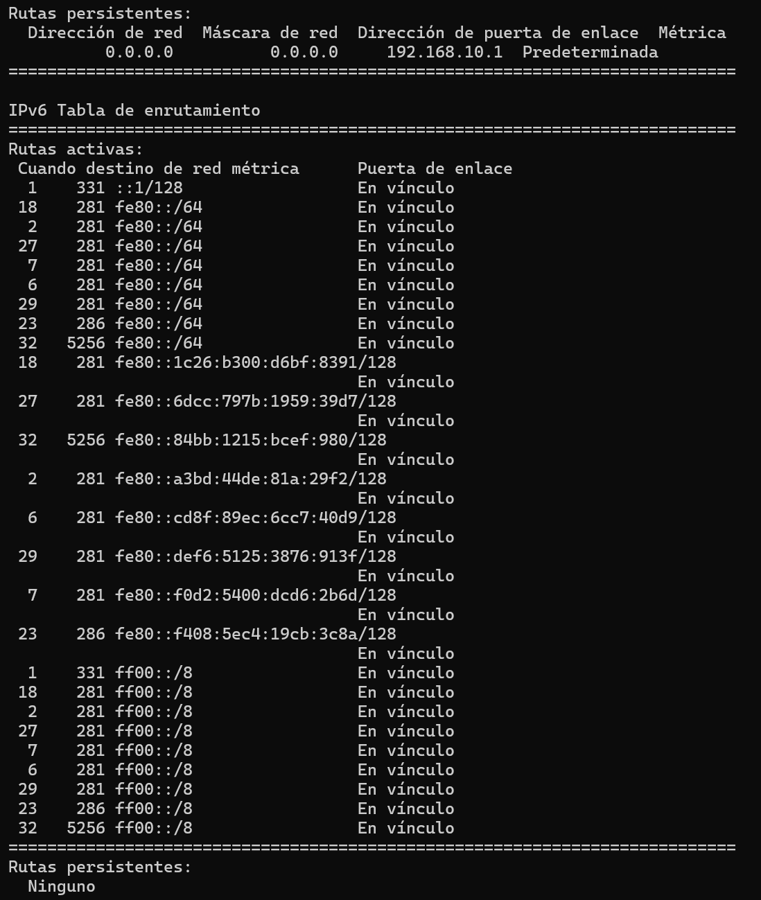

### nslookup:

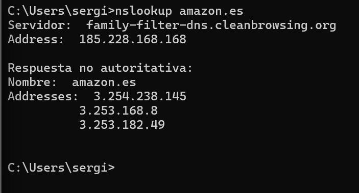


### netstat -an:

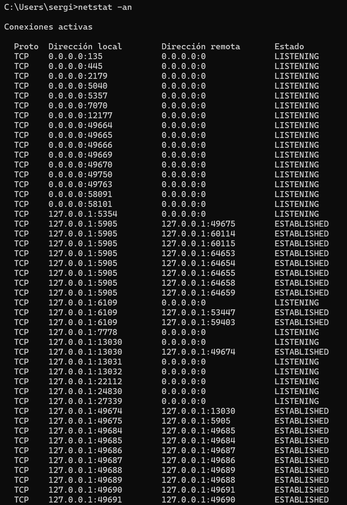

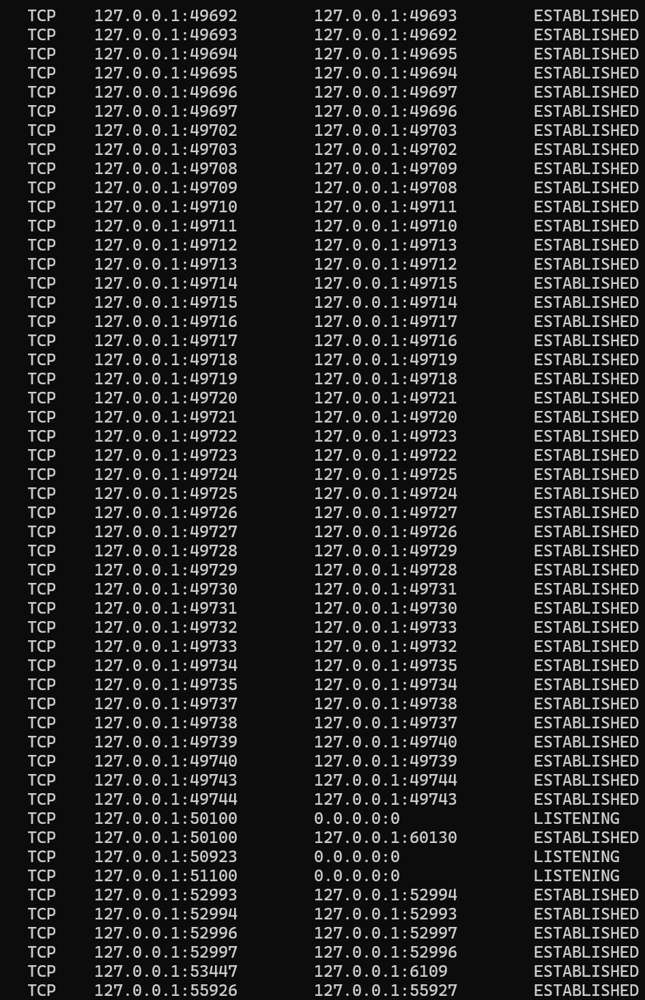

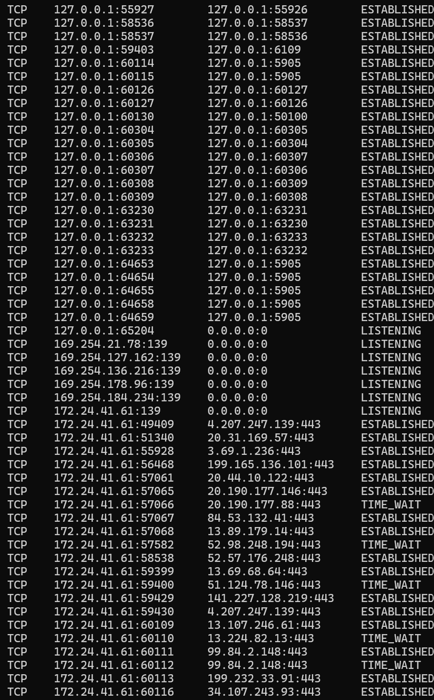

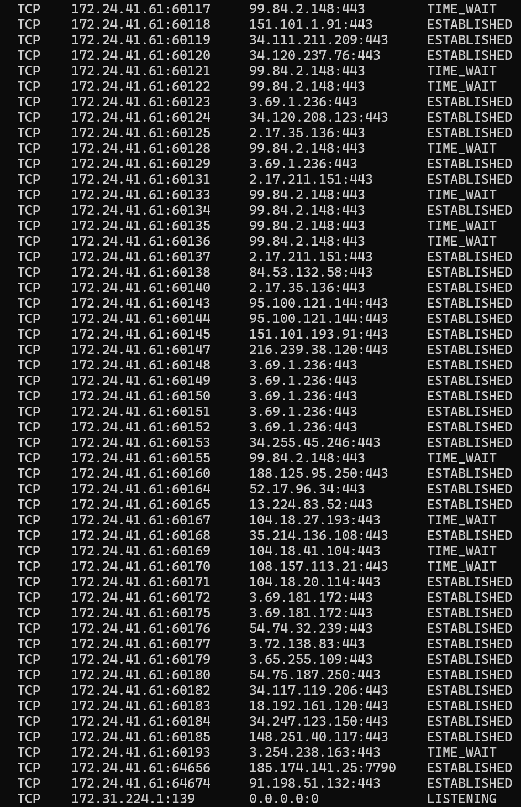

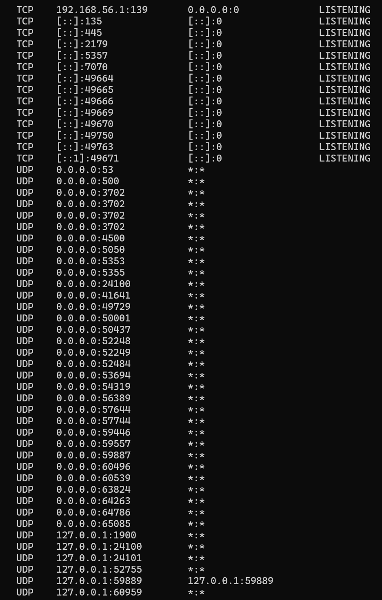

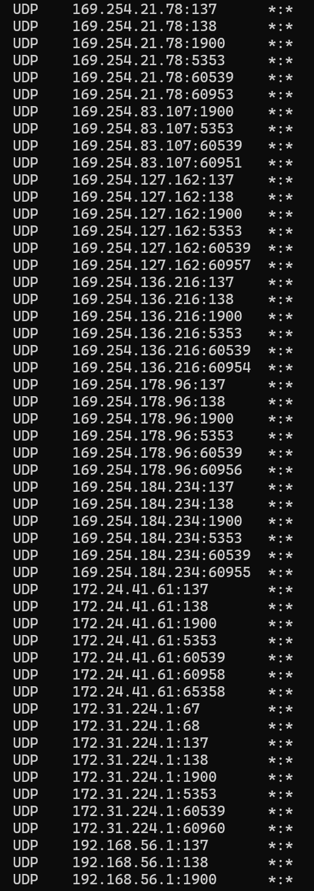

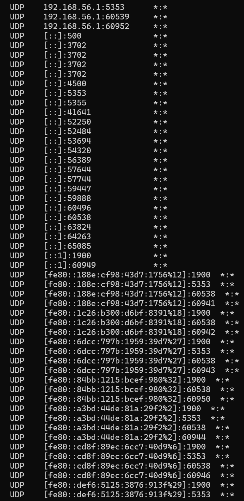

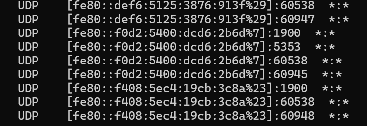


| Comanda | Què fa | Explicacio breu |
|---------|--------|-----------------|
|`ipconfi /all` | Mostra tota la configuració de xarxa del equip | Mostra tots els adaptadors físics i virutals del sistema(Les targetes Realtek i Intel WI-FI, els adaptadors virtuals de VirtualBox, Hyper-V i Tailescale). També apareicen les IPV4, IPV6, Màscares de subxarxa, gateway, DNS i si DHCP esta activat. |
| `ping google` | Comprova que l'equip te conexiò a google | La captura mostra que el ping a l'adreca `8.8.8.8` (DNS de Google) funciona correctament per tant hi ha conexió. |
|*

## B. Gestió de Firewall (Tallafoc)
**El firewall és la primera línia de defensa. En CLI, utilitzem netsh (o mòduls de PowerShell) a Windows i ufw (Uncomplicated Firewall) o iptables a Linux.**
**Windows (PowerShell):**
**Estat: Get-NetFirewallProfile**
**Obrir port (ex: 80): New-NetFirewallRule -DisplayName "HTTP" -Direction Inbound -LocalPort 80 -Protocol TCP -Action Allow**

**Linux (UFW):**
**Activar: sudo ufw enable**
**Estat: sudo ufw status**
**Obrir port (ex: 80): sudo ufw allow 80/tcp**

---


## 2. Scripts d'Automatització de Configuració

### Exercici 2. Executa aquests scripts en una màquina virtual o un entorn de proves. Canviar la IP de la teva màquina principal pot tallar la teva connexió a internet. Fes una captura de pantalla dels resultats obtinguts i comenta’ls!


A. Script per a Windows (PowerShell)
Aquest script configura una IP estàtica i defineix els servidors DNS. Desa'l com config_xarxa.ps1.

# Sol·licitar permisos d'administrador si no en té
if (!([Security.Principal.WindowsPrincipal][Security.Principal.WindowsIdentity]::GetCurrent()).IsInRole([Security.Principal.WindowsBuiltInRole] "Administrator")) { Start-Process powershell.exe "-NoProfile -ExecutionPolicy Bypass -File `"$PSCommandPath`"" -Verb RunAs; exit }

# Configuració de variables
$InterfaceAlias = "Ethernet" # Canvia-ho pel nom de la teva interfície (fes 'Get-NetAdapter')
$NewIP = "192.168.1.50"
$Gateway = "192.168.1.1"
$PrefixLength = 24 # Equival a mascara 255.255.255.0
$DNS = "8.8.8.8", "1.1.1.1"

Write-Host "Configurant xarxa per a $InterfaceAlias..." -ForegroundColor Cyan

try {
    # Eliminar IP anterior (per evitar conflictes) i posar la nova
    New-NetIPAddress -InterfaceAlias $InterfaceAlias -IPAddress $NewIP -PrefixLength $PrefixLength -DefaultGateway $Gateway -AddressFamily IPv4 -ErrorAction Stop
    
    # Configurar DNS
    Set-DnsClientServerAddress -InterfaceAlias $InterfaceAlias -ServerAddresses $DNS
    
    Write-Host "Configuració completada amb èxit." -ForegroundColor Green
    ipconfig /all
}
catch {
    Write-Host "Error: Potser la IP ja està assignada o la interfície no existeix." -ForegroundColor Red
    Write-Host $_.Exception.Message
}


B. Script per a Linux (Bash)
Aquest script utilitza la comanda ip (moderna). Tingues en compte que els canvis amb ip són volàtils (es perden al reiniciar) tret que modifiquis fitxers com /etc/netplan o /etc/network/interfaces. Desa'l com config_xarxa.sh.


#!/bin/bash

# Variables
IFACE="eth0" # Canvia-ho amb el resultat de 'ip link'
IP="192.168.1.50/24"
GATEWAY="192.168.1.1"
DNS="8.8.8.8"

# Comprovar si s'és root
if [ "$EUID" -ne 0 ]; then 
  echo "Si us plau, executa com a root (sudo)"
  exit
fi

echo "Configurant interfície $IFACE..."

# Netejar IPs existents
ip addr flush dev $IFACE

# Assignar IP i màscara
ip addr add $IP dev $IFACE

# Activar la interfície
ip link set $IFACE up

# Afegir porta d'enllaç
ip route add default via $GATEWAY

# Configurar DNS (temporalment a /etc/resolv.conf)
echo "nameserver $DNS" > /etc/resolv.conf

echo "Configuració aplicada. Verificant..."
ip addr show $IFACE
echo "Prova de ping a Google:"
ping -c 2 8.8.8.8


3. Monitorització de Xarxa amb Python
Aquest exercici requereix Python i ho heu d’executar en cada un dels sistemes operatius. El codi següent mostra una gràfica en temps real dels bytes enviats i rebuts.
Instal·la les llibreries necessàries:
pip install matplotlib psutil

Codi (monitor_xarxa.py):


import matplotlib.pyplot as plt
import matplotlib.animation as animation
import psutil
import time

# Configuració inicial
fig, ax = plt.subplots()
xs = [] # Temps
y_sent = [] # Bytes enviats
y_recv = [] # Bytes rebuts

# Variables per calcular la velocitat (diferencial)
last_sent = psutil.net_io_counters().bytes_sent
last_recv = psutil.net_io_counters().bytes_recv

def update(i):
    global last_sent, last_recv
    
    # Obtenir dades actuals
    net_io = psutil.net_io_counters()
    current_sent = net_io.bytes_sent
    current_recv = net_io.bytes_recv
    
    # Calcular velocitat (Bytes per segon en aquest interval)
    speed_sent = (current_sent - last_sent) / 1024 # Convertir a KB
    speed_recv = (current_recv - last_recv) / 1024 # Convertir a KB
    
    # Actualitzar referències anteriors
    last_sent = current_sent
    last_recv = current_recv
    
    # Afegir dades a les llistes
    xs.append(i)
    y_sent.append(speed_sent)
    y_recv.append(speed_recv)
    
    # Limitar la gràfica als últims 20 punts per que sigui llegible
    xs[:] = xs[-20:]
    y_sent[:] = y_sent[-20:]
    y_recv[:] = y_recv[-20:]
    
    # Netejar i dibuixar
    ax.clear()
    ax.plot(xs, y_recv, label='Descarrega (KB/s)', color='green')
    ax.plot(xs, y_sent, label='Pujada (KB/s)', color='blue')
    
    ax.set_title('Rendiment de Xarxa en Temps Real')
    ax.set_ylabel('Velocitat (KB/s)')
    ax.set_xlabel('Intervals de Temps')
    ax.legend(loc='upper left')
    ax.grid(True, linestyle='--', alpha=0.7)

# Animació: actualitza cada 1000ms (1 segon)
ani = animation.FuncAnimation(fig, update, interval=1000)

print("Iniciant monitorització... Tanca la finestra gràfica per sortir.")
plt.show()


Mentre el codi s'executa, obre el navegador i posa un vídeo de YouTube o fes un test de velocitat (tipus fast.com).
Observa com canvia la gràfica.


Exercici 3. Fes una captura de pantalla del funcionament del codi de Python, per cada un dels sistemes operatius.

4. Ampliació: Gestió Avançada del Firewall
Fins ara hem obert ports, però un administrador també ha de saber tancar-los i bloquejar amenaces.
A. Esborrar regles
Sovint ens equivoquem o un servei deixa d'utilitzar-se. Hem d'eliminar la regla per seguretat.
Linux (UFW): Primer cal veure les regles numerades: sudo ufw status numbered Després, esborrem pel número (per exemple, la regla 2): sudo ufw delete 2
Windows (PowerShell): Hem de buscar la regla pel nom i esborrar-la: Remove-NetFirewallRule -DisplayName "HTTP"
B. Bloquejar una IP (Banear un intrús)
Imagina que detectes que la IP 192.168.1.100 està intentant atacar-te.
Linux (UFW): sudo ufw deny from 192.168.1.100
Windows (PowerShell): New-NetFirewallRule -DisplayName "Bloqueig Atacant" -Direction Inbound -LocalPort Any -Protocol Any -Action Block -RemoteAddress 192.168.1.100

Exercici 4 (Posa les comandes utilitzades o captura la pantalla):
Crea una regla que obri el port 21 (FTP).
Comprova que existeix.
Elimina aquesta regla utilitzant les comandes d'esborrar vistes a dalt.
Fes una captura de pantalla del procés d'eliminació.


5. Millora dels Scripts: Fem-los Interactius
Els scripts anteriors tenien la IP "incrustada" (Hardcoded). Això és poc pràctic si volem configurar molts ordinadors amb IPs diferents. Modificarem els scripts perquè preguntin a l'usuari quina IP vol configurar.

Repte Windows (PowerShell)
Substitueix la línia $NewIP = "192.168.1.50" per una instrucció que demani dades (cerca la comanda).
Codi a modificar:

# ABANS IP FIXA, ARA DEMANADA A L’USUARI.
# $NewIP = "192.168.1.50"


Repte Linux (Bash)
Substitueix la variable IP per una lectura d'entrada (buscar la comanda).
Codi a modificar:
# ABANS IP FIXA:
# IP="192.168.1.50/24"


Exercici 5. Modifica els teus fitxers config_xarxa.ps1 i config_xarxa.sh amb aquests canvis. Executa'ls i assigna una IP diferent (ex: .60 o .70). Comprova amb un ping que la nova IP funciona.


6. Repte de Programació (Python): Alerta de Tràfic
Anem a modificar el codi de Python perquè no només mostri la gràfica, sinó que ens avisi per consola si la velocitat de baixada supera un límit (per exemple, si estem descarregant molt ràpid).
Instruccions: Al fitxer monitor_xarxa.py, busca la funció def update(i):. Just després de calcular speed_recv, afegeix aquesta condició lògica (IF):
Python
   # ... codi existent ...
    speed_recv = (current_recv - last_recv) / 1024 
    
    # --- AFEGIR AQUEST BLOC ---
    limit = 500 # Llindar de 500 KB/s
    if speed_recv > limit:
        print(f"ALERTA: Descàrrega alta detectada! -> {speed_recv:.2f} KB/s")
    # --------------------------

    # ... continuar amb el codi (last_sent = current_sent) ...

Exercici 6:
Afegeix el codi de l'"Alerta".
Executa el programa.
Obre un vídeo 4K a YouTube o fes un test de velocitat per superar els 500 KB/s.
Fes una captura de la terminal mostrant els missatges d'alerta ("ALERTA: Descàrrega alta...").

