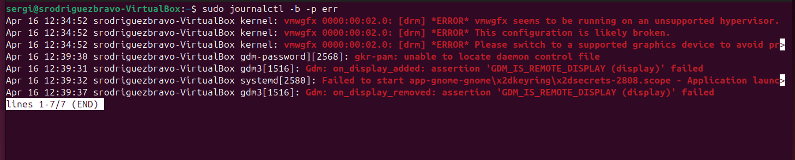
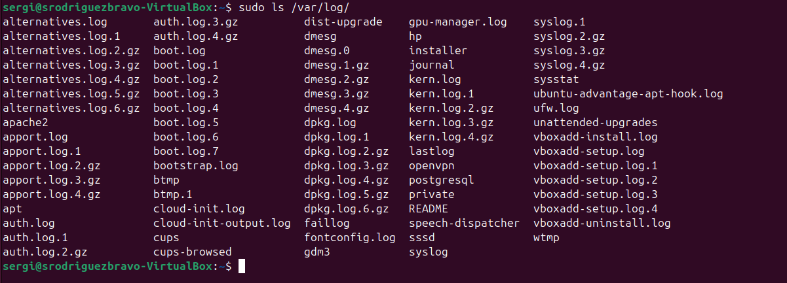
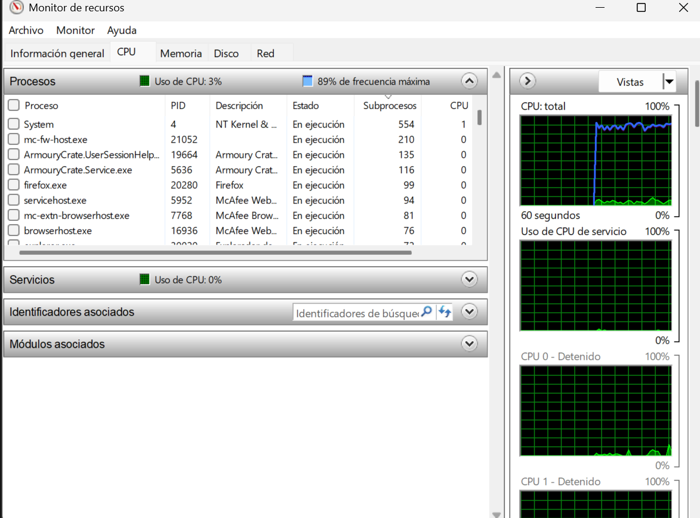
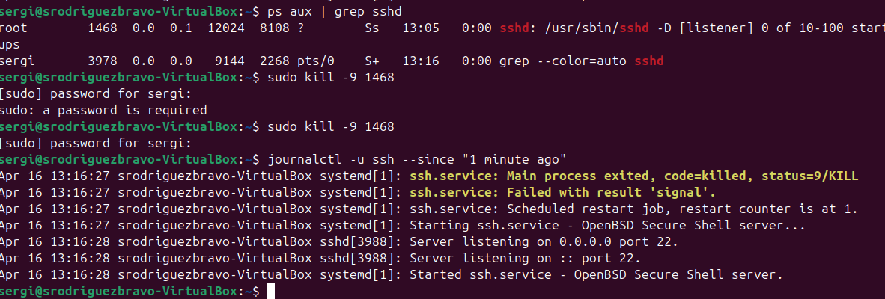
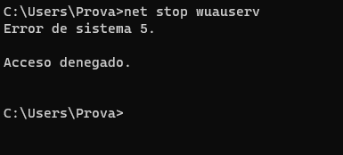
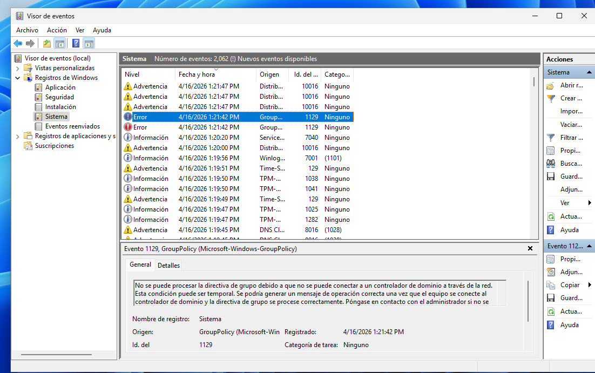
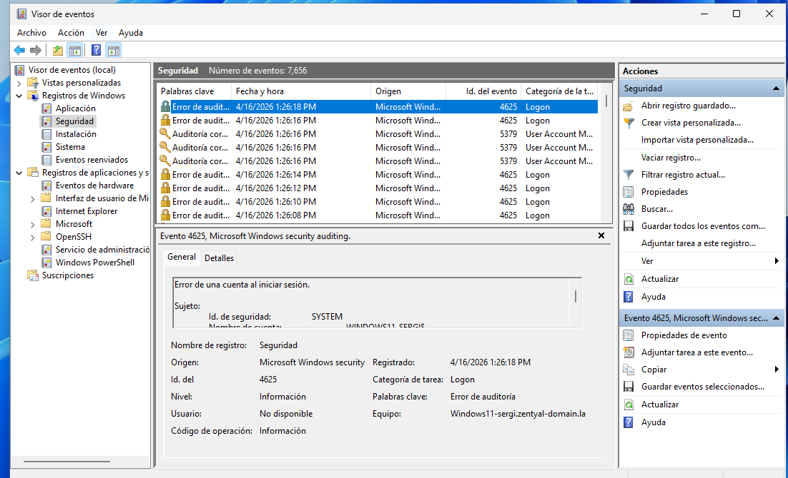
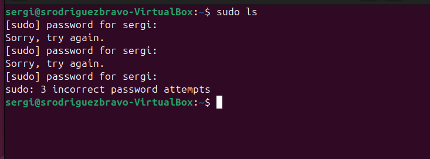
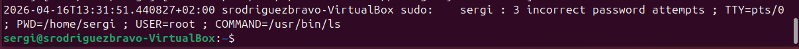
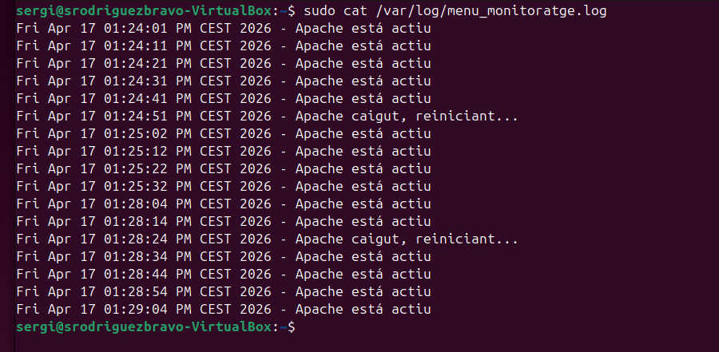

# Pràctica: Gestió i Monitoratge de Sistemes (Windows vs. Linux)


## Part 1: Windows 11 (Entorn Gràfic i CLI)
1.1. Registre de successos (Event Viewer)
Tasca: Obre l'Event Viewer (eventvwr.msc).
Activitat: Ves a Windows Logs > System. Filtra els esdeveniments per buscar només "Errors" i "Critical".


**Pregunta: Identifica un error recurrent. Quin és el seu Event ID i quina és la font (Source)?**


*L'id és 10317 i la seva font és NDIS "Vol dir que s'ha desactivat l'adaptador de xarxa de virtualBox"*

---

1.2. Monitoratge i Processos
Tasca: Utilitza el Resource Monitor (resmon).
Activitat: 1. Obre el navegador i reprodueix un vídeo en 4K.
1. Al Resource Monitor, observa la pestanya de CPU. Identifica quins subprocessos (threads) està generant el navegador.
*CPU en repóps:*


*Cpu reproduint un video 4k*


*Pasa de tenir 32 i 96 , i al obrir un navegador y reproduir el video pasen a 43, 71 i el navegador que esta reproduint el video te 103 subprocessos.*


2. Localitza un procés que no respongui o consumeixi massa i finalitza l'arbre de processos des del Task Manager.

 [](https://youtu.be/p0uFXKZr0Ac)


1.3. PowerShell: Monitoratge avançat
Comanda: Utilitza Get-Process i Get-EventLog.
Exercici: Executa una comanda per llistar els 5 processos que consumeixen més memòria RAM actualment.
```powershell
$ Get-Process | Sort-Object WorkingSet -Descending | Select-Object -First 5
```


---

## Part 2: Ubuntu 24.04 LTS (Terminal i GUI)
### ***2.1. Registre de successos (Journald i logs)***

*A Linux, el registre centralitzat es gestiona amb systemd-journald.*


***1. Visualitza els logs en temps real: sudo journalctl -f.:***

[](https://youtu.be/z7IQmeOrzV8)


***1. Filtra per veure només els errors de l'actual arrencada (boot):***



***On es guarden físicament els logs tradicionals a Ubuntu?*** 

*Els logs per defecte és guarden fisicament a la carpeta /var/log.*

```bash
ls /var/log/
# Podem veure tots els archius logs.
```


### 2.2. Gestió de Processos (CLI):
*Utilitzar top, htop i ps.*

**Llança un procés en segon pla,Troba el seu PID, canvia la seva prioritat amb renice i finalment matarlo.**

[](https://youtu.be/VJgjqBx5DfU)


### ***2.3. Monitoratge d'aplicacions***
*Utilitzar l'System Monitor (interfície gràfica) i glances.*

***1.Compara la càrrega de la CPU entre un estat de repòs i obrint diverses pestanyes de Firefox. Dibuixa una petita gràfica o captura la variació del "Load Average".***

*Estat de la cpu en repòs és de 3%.*


*Prova de càrrega de la CPU*
[](https://youtu.be/BYnPvUrt2Gw )

**
---
## ***Taula Comparativa de Comandes***
| Concepte          | Windows 11 (Powershell/CMD) | Ubuntu 24 (Terminal) | 
|-------------------|-----------------------------|----------------------|
| LListar Processos | Get-Process /tasklist       | ps aux / top         |
| Finalitzar procés | Stop-Process -ID [PID]      | kill [PID]           |
| Logs del sistema  | Get-EventLog -LogName System| journalctl / dmesg   |
| Rendiment CPU/RAM | perform                     | htop / glances       |

*
---

## EXERCICIS ADDICIONALS

***1. Provoca un error (per exemple, intentant aturar un servei crític) i mostra com queda registrat en el visor de successos de Windows i al journalctl d'Ubuntu.***

1. **Error a linux:** *Provocarem un error intentant matar el proccés SSH i quant ens demani la contrasenya farem ctl + C per cancelar-ho*



2. **Error a Windows:** *Per provocar un error critic a windows el que farem és el següent, obrirem una pestanya de CMD i posarem la següent comanda:*
```powershell
net stop wuauserv
```
*Aquesta comanda serveix per finalitzar el servei de Windows Update, aquest és un servei crític del sistema, i com l'estem executant com a usuari normal i no amb "Executar com Adminsitrador", els serveis del sistema només poden ser modificats per usuaris amb permisos d'Adminsitrador.*



*Ara si anem al visor d'esdevediments de Windows podem veure l'error*



***2. Simularem un intent d'accés no autoritzat per aprendre a llegir registres de seguretat.***

1. **Windows:** *Intenta iniciar sessió amb un usuari inexistent o una contrasenya errònia 5 vegades.*

**Troba l'esdeveniment al Security Log. Quin és el Event ID per a un "Audit Failure"?**


*L'ID de l'error és 4625.*

1. **Ubuntu:** *Fes el mateix intentant fer sudo amb una contrasenya incorrecta.*



**Revisa el fitxer /var/log/auth.log. Quina informació ens dóna sobre l'adreça IP o el terminal des d'on s'ha intentat l'atac?**



*En aquest cas ens dona la informació de la data i l'hora a la que s'ha inentat fer el sudo, El nom del equip que ha intentat fer sudo, l'usuari que ho ha intentat, el terminal des d'on s'ha intentat que en aquest cas es el TY0.*

---

## Automatització d’alertes:

### **Windows (Task Scheduler): Configura una "Scheduled Task" que s'activi automàticament quan aparegui un esdeveniment específic al log de sistema (per exemple, quan es connecti un dispositiu USB). L'acció ha de ser mostrar un missatge en pantalla o executar un script.**
  > **⚠️ Important:** No funciona
  > 
  > *Ja no funcióna windows no executa res cuan és connecta un usb*
   >

### ***Ubuntu (Scripts de monitoratge):*** 
**Crea un petit script en Bash que revisi cada 10 segons si el servei d'Apache (o qualsevol altre) està actiu. Si s'atura, l'script l'ha de reiniciar i escriure una línia en un fitxer de log propi: /var/log/meu_monitoratge.log.**
> **💡 Explicació:**
>
> *Jo he fet el següent script.*
>

```bash
#!/bin/bash
LOG="/var/log/meu_monitoratge.log" #Indiquem la ruta al que guardara el lOG.
while true  #mentre sigui cert "Sempre sera cert ja que no indiquem res per que canvi a false."
do  
    if systemctl is-active --quiet apache2 # Comprova si apache esta actiu fent systemctl apache2 i mira si esta active.
    then   
        echo "$(date) - Apache está actiu" >> $LOG #Guarda al archiu LOG la data i l'hora i el text Apache está actiú.
    else
        echo "$(date) - Apache caigut, reiniciant..." >> $LOG # Si al fer el systemclt apache2 detecta que no está actiu guarda al LOG  la data i el missatje de que ha caigut
    fi
    sleep 10 #Interval de 10 segons.
done
```
**Demostració del funcionament:**


[](https://youtu.be/l5ZStKRTMZA)


**Comprovacio a /var/log/meu_monitoratge.log:**



---