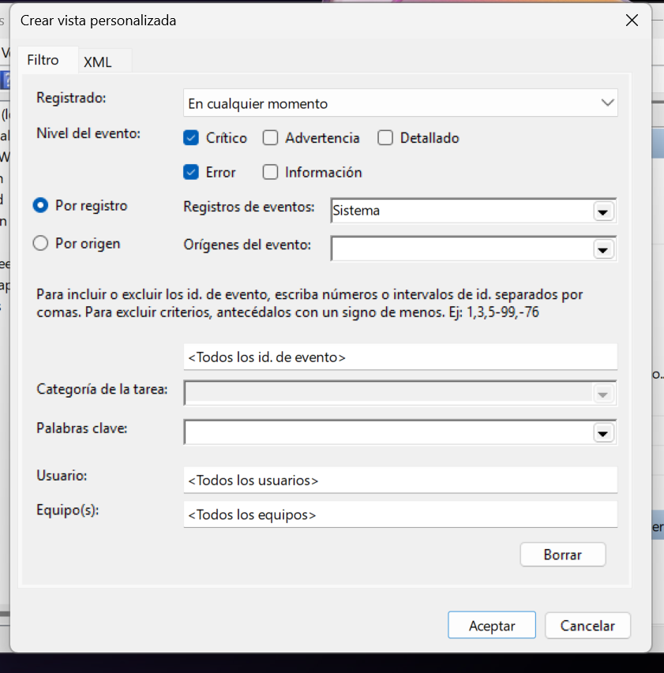
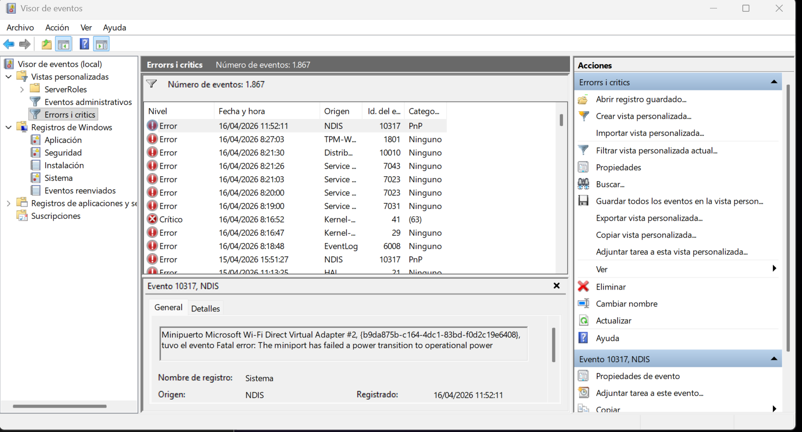
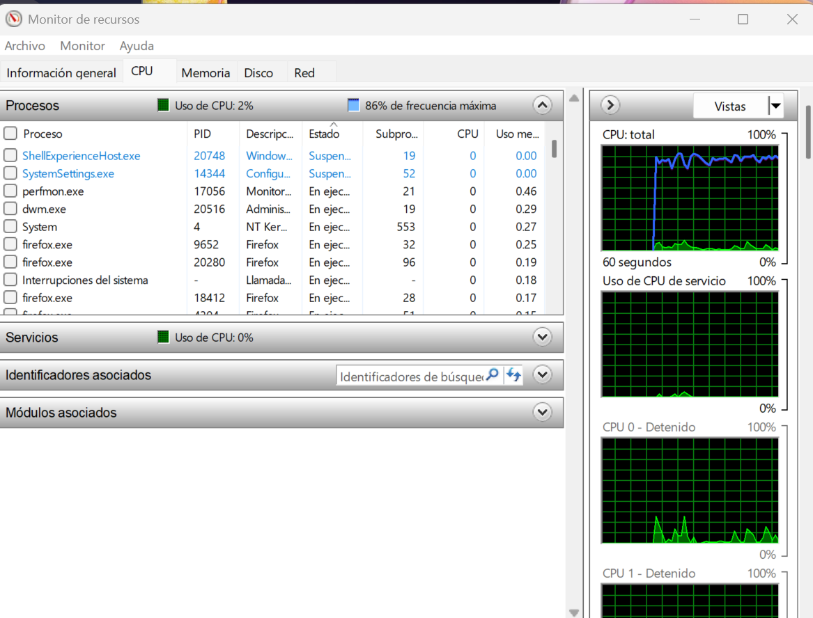
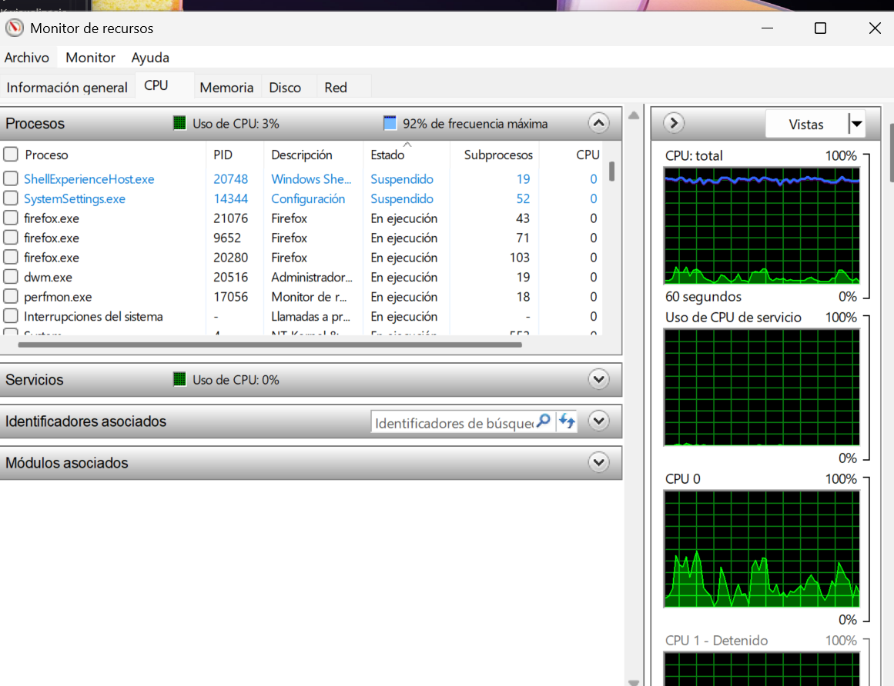
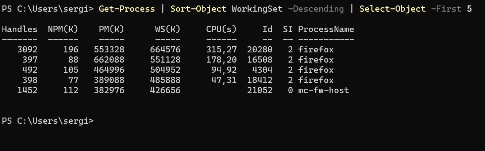

# Pràctica: Gestió i Monitoratge de Sistemes (Windows vs. Linux)


## Part 1: Windows 11 (Entorn Gràfic i CLI)
1.1. Registre de successos (Event Viewer)
Tasca: Obre l'Event Viewer (eventvwr.msc).
Activitat: Ves a Windows Logs > System. Filtra els esdeveniments per buscar només "Errors" i "Critical".



**Pregunta: Identifica un error recurrent. Quin és el seu Event ID i quina és la font (Source)?**




*L'id és 10317 i la seva font és NDIS "Vol dir que s'ha desactivat l'adaptador de xarxa de virtualBox"*

---

1.2. Monitoratge i Processos
Tasca: Utilitza el Resource Monitor (resmon).
Activitat: 1. Obre el navegador i reprodueix un vídeo en 4K.
1. Al Resource Monitor, observa la pestanya de CPU. Identifica quins subprocessos (threads) està generant el navegador.
*CPU en repóps:*


*Cpu reproduint un video 4k*


*Pasa de tenir 32 i 96 , i al obrir un navegador y reproduir el video pasen a 43, 71 i el navegador que esta reproduint el video te 103 subprocessos.*


2. Localitza un procés que no respongui o consumeixi massa i finalitza l'arbre de processos des del Task Manager.

 [](https://youtu.be/p0uFXKZr0Ac)


1.3. PowerShell: Monitoratge avançat
Comanda: Utilitza Get-Process i Get-EventLog.
Exercici: Executa una comanda per llistar els 5 processos que consumeixen més memòria RAM actualment.
```powershell
$ Get-Process | Sort-Object WorkingSet -Descending | Select-Object -First 5
```


---

## Part 2: Ubuntu 24.04 LTS (Terminal i GUI)
### ***2.1. Registre de successos (Journald i logs)***
A Linux, el registre centralitzat es gestiona amb systemd-journald.
Tasca: Utilitza la comanda journalctl.
Activitat: 1. Visualitza els logs en temps real: sudo journalctl -f.
1. Filtra per veure només els errors de l'actual arrencada (boot): journalctl -b -p err.
Pregunta: On es guarden físicament els logs tradicionals a Ubuntu? (Pista: /var/log/).
2.2. Gestió de Processos (CLI)
Tasca: Utilitzar top, htop i ps.
Activitat:
Instal·la htop si no hi és: sudo apt install htop.
Llança un procés en segon pla (per exemple, sleep 1000 &).
Troba el seu PID, canvia la seva prioritat amb renice i finalment mata'l amb kill -9.
2.3. Monitoratge d'aplicacions
Tasca: Utilitzar l'System Monitor (interfície gràfica) i glances.
Activitat: Compara la càrrega de la CPU entre un estat de repòs i obrint diverses pestanyes de Firefox. Dibuixa una petita gràfica o captura la variació del "Load Average".

Taula Comparativa de Comandes
Concepte
Windows 11 (PowerShell/CMD)
Ubuntu 24 (Terminal)
Llistar processos
Get-Process / tasklist
ps aux / top
Finalitzar procés
Stop-Process -ID [PID]
kill [PID]
Logs del sistema
Get-EventLog -LogName System
journalctl / dmesg
Rendiment CPU/RAM
perfmon
htop / glances


EXERCICIS ADDICIONALS
Resolució de problemes: Provoca un error (per exemple, intentant aturar un servei crític) i mostra com queda registrat en el visor de successos de Windows i al journalctl d'Ubuntu.

Simularem un intent d'accés no autoritzat per aprendre a llegir registres de seguretat.
Windows: Intenta iniciar sessió amb un usuari inexistent o una contrasenya errònia 5 vegades.
Tasca: Troba l'esdeveniment al Security Log. Quin és el Event ID per a un "Audit Failure"? (Hauria de ser el 4625).
Ubuntu: Fes el mateix intentant fer sudo amb una contrasenya incorrecta o intentant entrar per SSH (si està configurat).
Tasca: Revisa el fitxer /var/log/auth.log. Quina informació ens dóna sobre l'adreça IP o el terminal des d'on s'ha intentat l'atac?
Automatització d’alertes
Windows (Task Scheduler): Configura una "Scheduled Task" que s'activi automàticament quan aparegui un esdeveniment específic al log de sistema (per exemple, quan es connecti un dispositiu USB). L'acció ha de ser mostrar un missatge en pantalla o executar un script.
Ubuntu (Scripts de monitoratge): Crea un petit script en Bash que revisi cada 10 segons si el servei d'Apache (o qualsevol altre) està actiu. Si s'atura, l'script l'ha de reiniciar i escriure una línia en un fitxer de log propi: /var/log/meu_monitoratge.log.