# 📘 Exercicis de Virtualització:
---
## 🖥️ Exercici 1: VirtualBox - Part teòrica

### Limitacions de les màquines virtuals:
*Explica les limitacions (de hardware màxim) de les màquines virtuals per a la última versió. Ho trobaràs quan crees una màquina virtual nova:*
- **Base Memory:** *És la RAM de la màquina virtual, i està limitada a **1TB (1024GB)***
 
- **Number of CPUs:** *És el número de CPU que vols tenir a la màquina virtual; i aquest en la ultima versiò pot variar.*

*Per defecte el màxim és **32 cpu**, però si tens un processador amb 24 nuclis físics amb la tecnologia Hyper-Threading, VirtualBox permet **48 cpu***

- **Tamany del disc:** *El màxim és **2 TB**.*

---
### 1. Tipus de Xarxa:
*Explica detalladament els tipus de xarxa bridge, NAT i Host-Only.*
1. 🌉**Adaptador Pont (Bridge) :**
   *Funciona de la següent manera: si selecciones adaptador pont, VirtualBox connecta la màquina virtual directament a la xarxa real.*
 
  *Per defecte, VirtualBox configura l’adaptador en automàtic **DHCP**, amb la qual cosa:*
- *La màquina virtual demanarà una petició d’IP al servidor DHCP de la xarxa real. Aquest detectarà la màquina virtual com un host real més i li assignarà una IP de la xarxa.Això permet que la màquina virtual accedeixi a internet.*  
- *Es pot comunicar amb les MV connectades al mateix node (Switch, Punt d’accés, etc.) i també amb altres màquines reals.*

2. 🌐 **Xarxa nat:***

*És el tipus de xarxa que selecciona VirtualBox per defecte.*

*La xarxa NAT funciona de la següent manera:* *VirtualBox crea un router amb un servidor **DHCP** per les MV,a diferència de l’adaptador pont que pots configurar la màquina en DHCP o amb una IP estàtica, en la xarxa NAT es recomana utilitzar només **DHCP**.*

*Diferencies:*
- *Dona menys opcions que l’adaptador pont (no permet seleccionar l’adaptador de xarxa real, l’opció de **Mode promiscu està deshabilitada**).*
- *Permet fer renviament de ports.*
- *Les MV es poden comunicar amb la resta de màquines de la xarxa real, també amb les màquines virtuals, però a diferència de l’adaptador pont, les màquines reals no es podran comunicar amb les MV.*
 

3. 🔒 **Host-Only:**
   
*És un tipus de xarxa que crea una xarxa virtual privada entre el teu ordinador i les màquines virtuals.*

*Observacions:*
- *La màquina virtual només es podrà comunicar amb el **host** (l’ordinador real) i amb altres MV connectades a la mateixa xarxa Host-Only.*
- *Aquesta xarxa privada **no té connexió a internet** a no ser que configuris un altre adaptador de xarxa en NAT o Adaptador Pont.*

----
### 2. Si veiem que el disc dur no és prou gran, sabries dir si hi ha cap opció de fer-lo més gran un cop s’ha creat?

*Sí, en el menú de **Archivo** i **Administrador de medis virtual** o fent **Ctrl+D**, i seleccionant el disc de la màquina virtual fent dos clics i en l’apartat de **Tamany** el podem augmentar.*  

⚠️ Amb cura: una vegada augmentat **no es pot tornar a reduir**.

---
### 3. Fixa’t quan ocupa el disc dur un cop creada la màquina virtual (ves a la carpeta on es creen els fitxers de la màquina virtual). Ens hi cabrà un sistema operatiu? Explica’n el motiu i comenta avantatges i inconvenients:

*Sí, es pot instal·lar un sistema operatiu, ja que VirtualBox per defecte crea un **disc dinàmic**.* 

*El disc dinàmic vol dir que si crees un disc de 50GB, aquest disc **no ocuparà els 50GB des del principi**, sinó que ocuparà molt menys MB, i s’anirà augmentant quan sigui necessari fins arribar al màxim dels 50GB.*
*Això permet que, encara que al principi ocupi pocs MB, quan es vulgui instal·lar el sistema operatiu, el disc s’anirà augmentant l’espai necessari per poder instal·lar-lo.*

**Avantatges:**  
- **Estalvi d’espai en disc:** *ja que no ocuparà els 50GB de cop, sinó que començarà ocupant molt poc i s’anirà augmentant.* 
- **Flexibilitat:** *El sistema operatiu només necessita 10GB per instal·lar-se i l’arxiu només ocuparà això, s’anirà augmentant i només ocuparà el que necessites.*

**Desavantatges:**  
- **Rendiment:** *Cada cop que el disc creix hi pot haver una petita baixada de rendiment.*  
- **Ocupació del disc real:** *Si el disc de la màquina virtual està creat per ocupar 50GB, però al host només tens 30GB lliures, quan la màquina virtual creixi fins a superar els 30GB ja no podrà créixer més.*

---
## 🖥️ Exercici 2: VirtualBox - Part pràctica: Instal·lació i recursos:

### 4. Cerqueu la ISO d’una versió de Windows i fes-ne la instal·lació. Per exemple, Windows 11.  
### 5. Un cop estigui instal·lat, realitzeu una taula comparativa del rendiment dels principals recursos (disc dur i memòria) amb la MV apagada i engegada:
1. **Captura del rendiment amb la màquina apagada:**
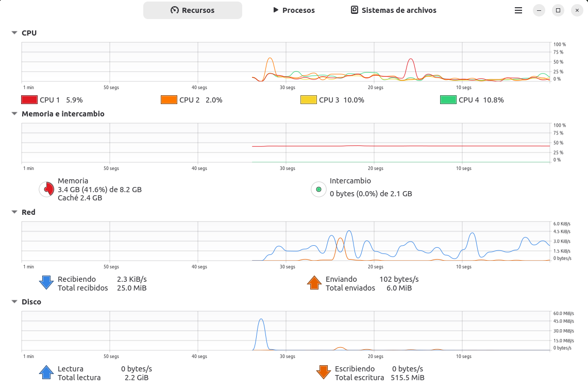 

2. **Captura del rendiment amb la màquina virtual encesa:**
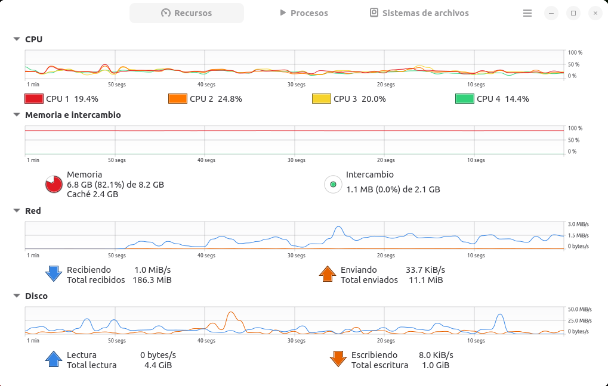 

---

## 🌐 Exercici 3: VirtualBox - Part pràctica: Proves de xarxa

### 6. A la segona pregunta, has explicat els diferents tipus de configuracions de xarxa virtuals. Per cada tipus, realitza’n una prova que ho justifiqui. Comenta què has fet. Pots fer una taula comparativa.

1. **Maquina virtual amb xarxa NAT, ping de MV -> Host i la fallada de Host -> MV:**
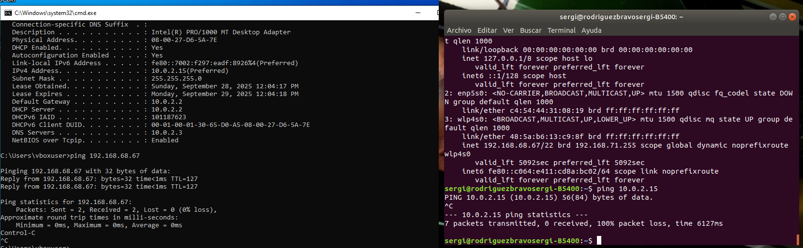 
1. **MV amb adaptador pont, ping de MV -> Host i de Host -> MV:**
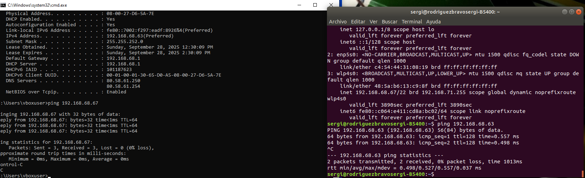

---

## 💾 Exercici 4: VirtualBox - Part pràctica: Exportació i discs

### 7. Cerca com fer còpies o exportació de màquines virtuals. Un cop fet, mira de crear una nova màquina important la primera màquina que has implementat:
1. **Primer pas: Crea la nova maquina virtual:**
 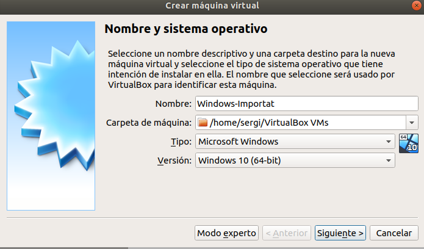
2. **Segon pas: Seleccionar utilitzar dic existent i seleccionar el vdi de la vm:**
  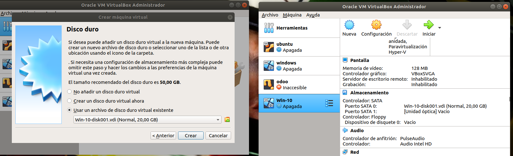
3. **Tercer pas: Comprovació:**
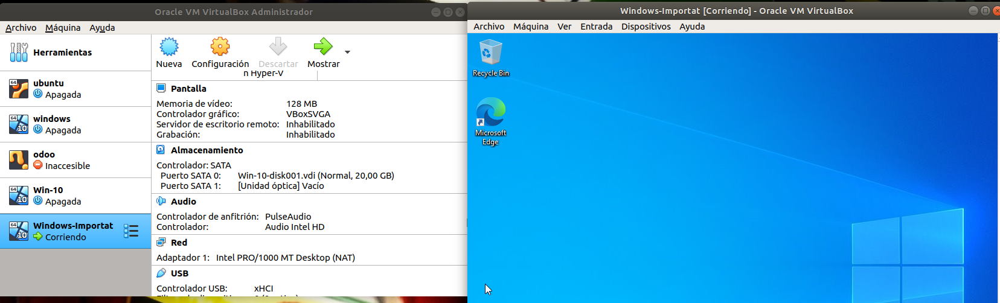

### 8. Explica com pots afegir un disc dur nou a la primera màquina virtual que has creat. Arrenca la màquina virtual i mostra una captura on es vegi que el sistema operatiu ha detectar els 2 discos durs:

1. **Primer pas:**
 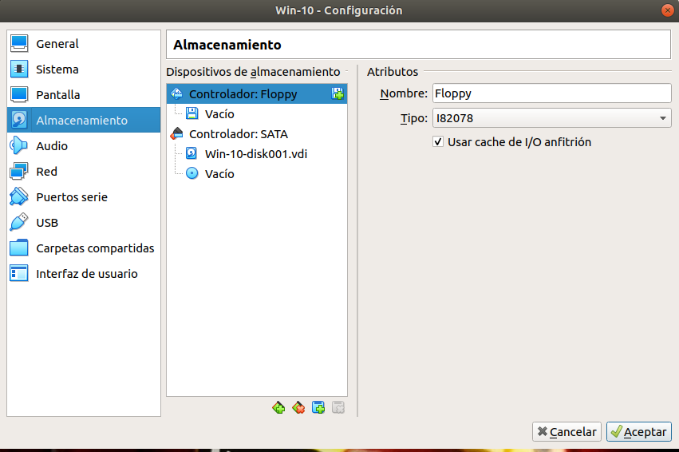

2. **Segon pas:**
   
  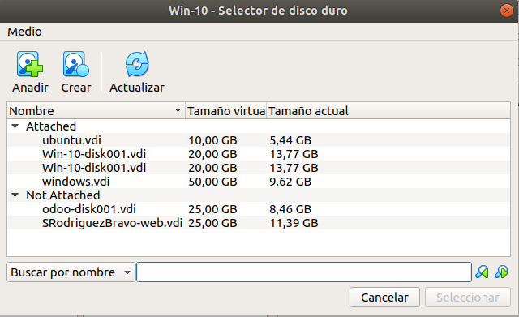

3. **Tercer pas:**
   
   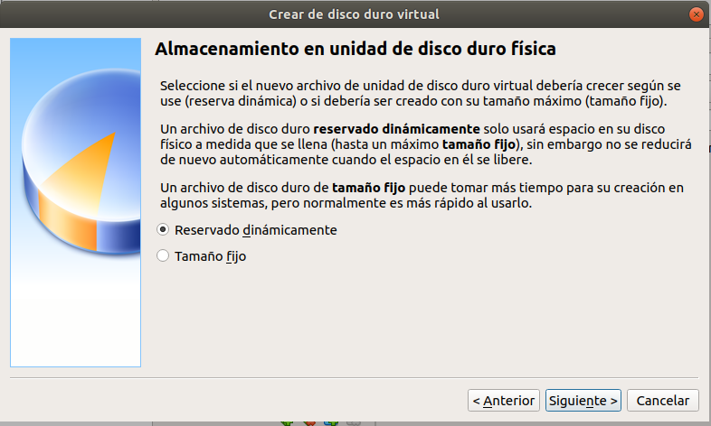

4. **Quart pas:**
   
   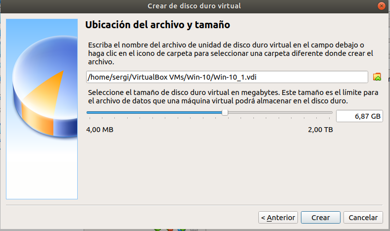

5. **Cinque pas: Comprovació:**
   
   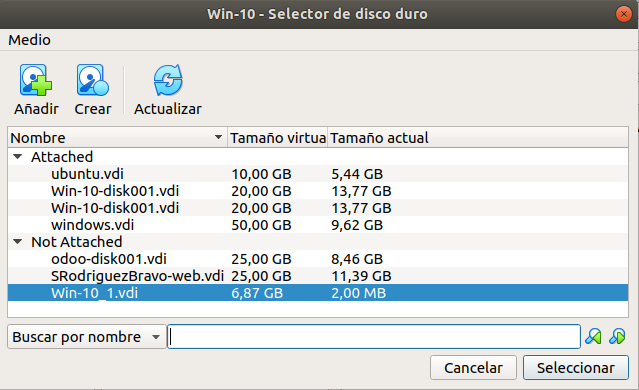
  
6. **Sise pas: Comprovació:**
   
   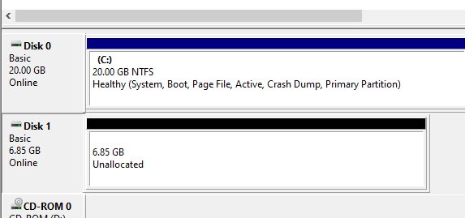
  
7. **Septim pas: Comprovació:**
   
   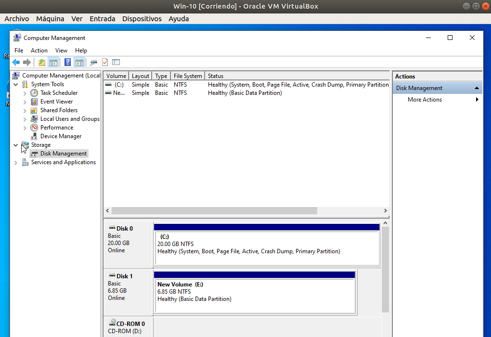

### 9. Esborra la màquina virtual. Ves a la carpeta on n’has realitzat la instal·lació. Ha esborrat els fitxers?:
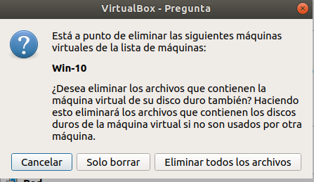
**Demostraciò:**
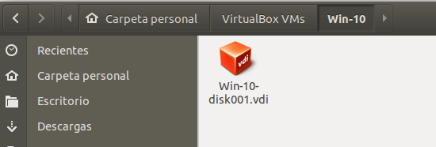

---

## 🐳 Exercici 5: Prova de Docker

### Enunciat
Realitzeu els passos següents i feu una captura de pantalla per confirmar que funciona.

1. **Demostracio 1:**  
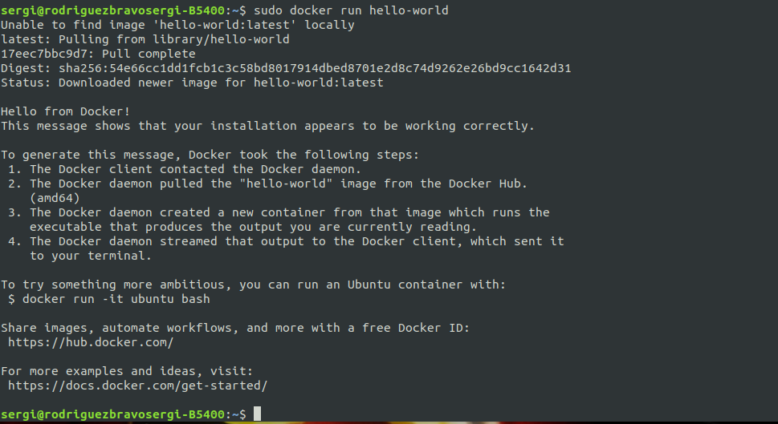
2. **Demostracio 2:**
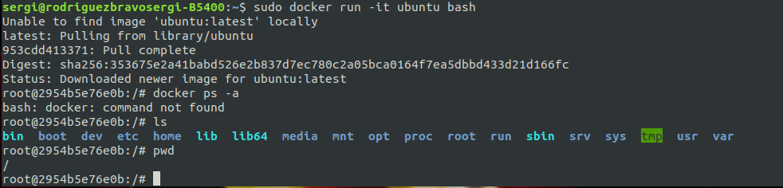

