# 🖥️ Gestors d'arrencada i sistemes duals (Windows 11 + Ubuntu 24.04):
----
1. ## 📘 Introducció:
*Quan s’inicia un ordinador modern amb **UEFI**, aquest firmware comprova el maquinari i busca a la partició especial **EFI System Partition (ESP)** els fitxers d’arrencada. (Abans de **l’UEFI**, el que dominava era el **BIOS clàssic** (Basic Input/Output System))*
**Resum històric:**
**Anys 1980 fins a mitjans 2000** →*gairebé tots els PCs feien servir BIOS.*


*El BIOS estava gravat en una memòria ROM de la placa base i:*


*Inicialitzava el maquinari bàsic (CPU, memòria, teclat, disc dur...).*


*Buscava el primer dispositiu d’arrencada i llegia el primer sector (els **512 bytes del MBR**).*


*Cedia el control al codi del gestor d’arrencada.*


**Limitacions del BIOS + MBR:**


*Només podia gestionar **discos fins a 2 TB**(perquè el MBR només té 32 bits per adreces de sectors). GPT permet discs de fins a 9,4 ZB (zetabytes)*


*Només admetia 4 particions primàries (o 3 + una estesa amb lògiques).*


*Interfície molt bàsica en mode text (no gràfica).*


*Inicialització lenta i poc flexible.*


*Sense seguretat: qualsevol codi al MBR podia executar-se.*


**Transició:**


*Cap al 2005–2010, es va començar a introduir UEFI (Unified Extensible Firmware Interface), impulsat per Intel.*


*Windows va adoptar UEFI de manera generalitzada a partir de Windows 8 (2012).*


*Avui, tots els ordinadors nous venen amb UEFI i disc particionat en GPT en lloc de MBR.*
---

2. ## Pràctica guiada.Realitzar captures de pantalla de cada pas.
>[!TIP] - objectiu
>*Configurar un sistema >**dual-boot** 
>amb **Windows 11** i >**Ubuntu 24.04** i
>apendre a reparar el gestor d'arrancada.*
>

>[!IMPORTANT]- Explicació:
>*Jo degut a les caracteristiques del meu ordinador he tingut que fer servir **Windows 10** i **Ubuntu 18.04**.*
>

### 1. Instal·lació i configuració de windows 10 i crecacio de particions :
1. **Pasos preinstalació:**
   1. **RAM:***En aquest cas sel·leciono (4096MB) 4GB, que es la meitat de la meva RAM.*
   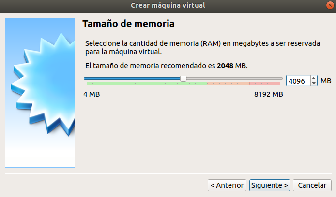
   2. **Disc:** *Seleccionem crear un disc dinàmic en format vdi i en aquest cas li donem un espai de **130GB**.*
   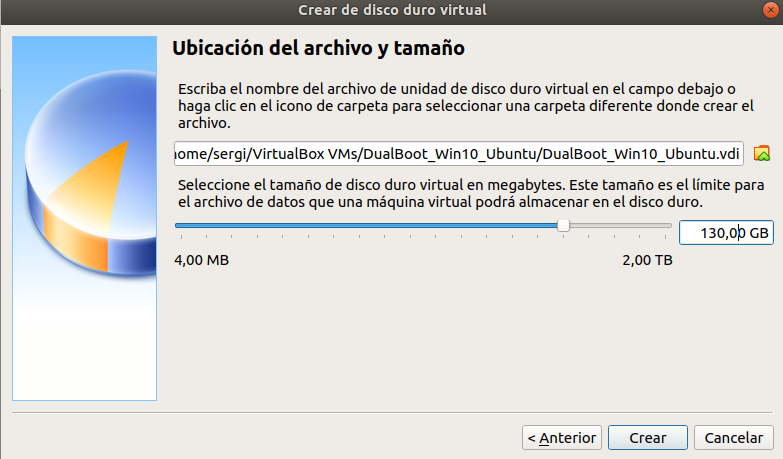
    3. **Sistema:** *En l'ordre d'arrancada posem la iso per debant del disc.*
  > **⚠️ Important:** Desactivar el Sistema EFI
  > 
  > *Encara que amb el sistema EFI és mes recomenable que el sitema bios ja que l'EFI permet mes particions que EFI,pero el sistema EFI dona problemes amb el dualBoot a virtualbox , axi que per que no doni problemes es important desactivaro.*
   >
   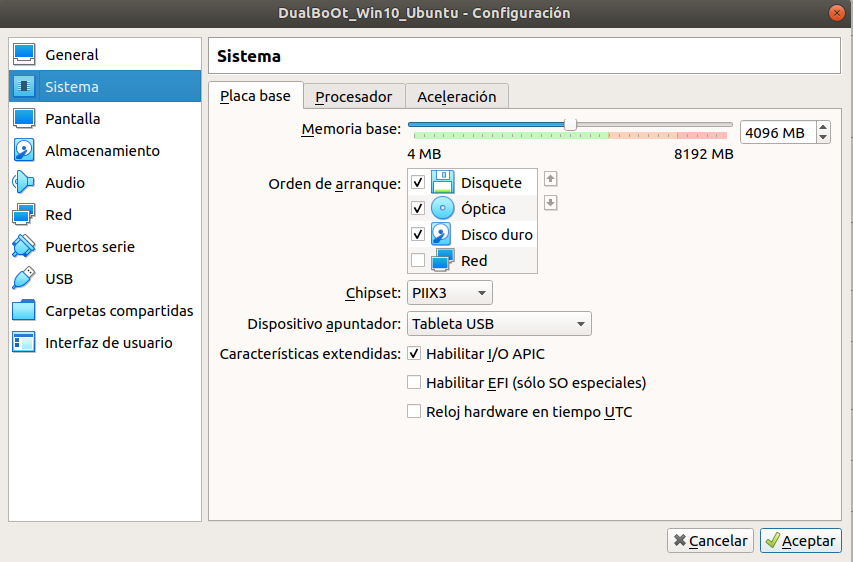
   4. **CPU:Configuració→Sistema →Processador:** *Seleccionar dos CPU.*
   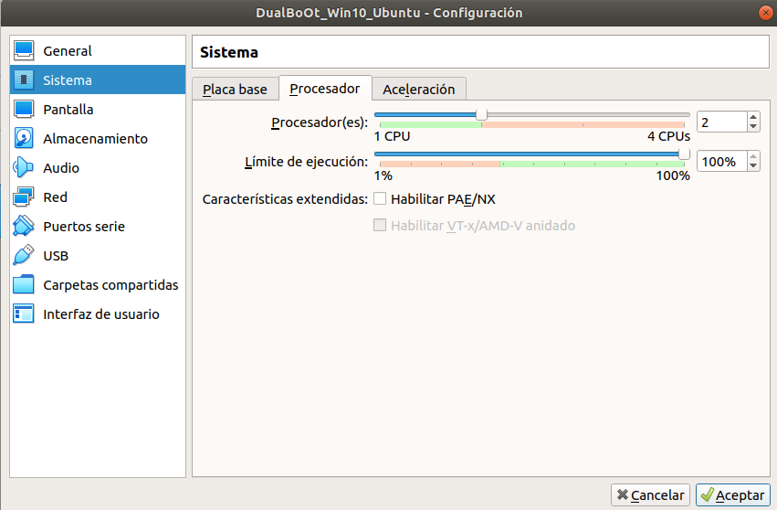

2. **Instalacio Windows 10:**
   1.**Tipus d'instalació:** *Seleccionar personalizada: instalar solo windows 10 (avanzado).*
   2.**Creacio de les particions:** 
   *Per defecte auria de sortir així:*
   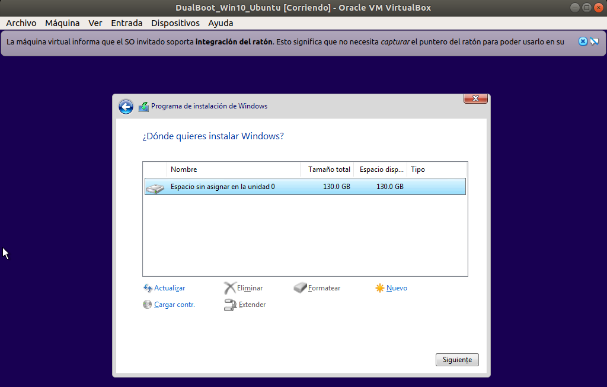
   
   **En aquest cas ens demana crear les particions ESP, una particio per el sistema i deixar espai lliure per l'ubuntu.** 
   *El primer pas es afegir una nova partició i en el tamany seleccionar 61440MB (60GB), i Windows ja ens creara automaticament la particio ESP.*

   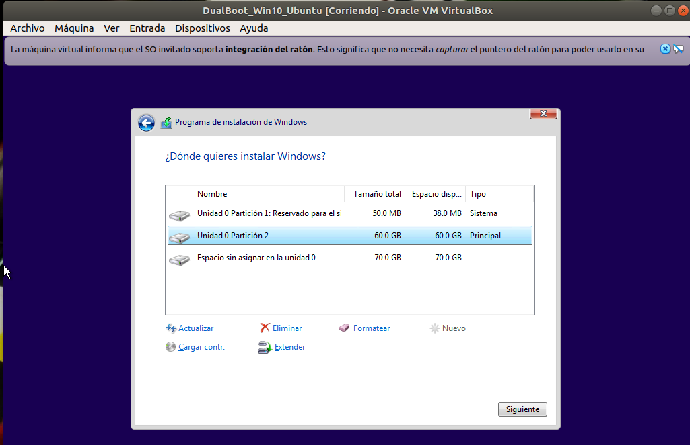
   3. **Comprobacio:** *Comprobarem que les particions del disc son les correctes una vegada instalat windows.*
   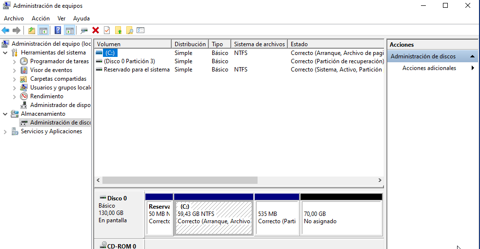
----
3. **Preparacio de windows per dual abans de instalar ubuntu.**
  
  *Desactivarem **Fast Startup** obrint el cmd com administrador i executarem:*
  
```powershell
 powercfg /h off
 ```
-------
### 2. Instalació d'Ubuntu 18.04:
1. **Comprovacions abans d'arrencar:**
   - Comprovem que EFI estigui desactivat.
   - Treurem l'ISO de Windows i afegirem la d'Ubuntu.
  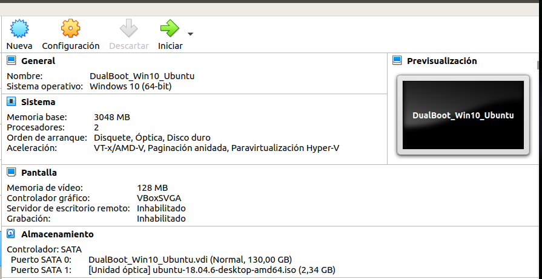
2. **Seleccionem Instalar Ubuntu:**
   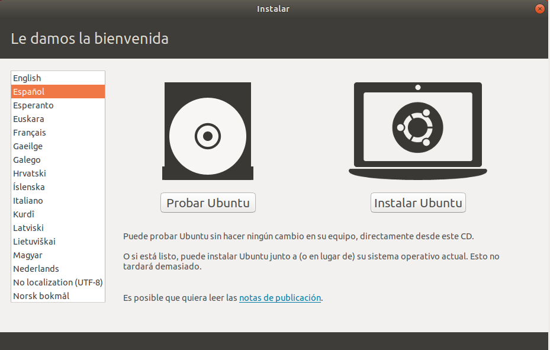
>[!TIP] -Impotant
>he comprobat que ha varis companys
>els i fallaba el dualboot a l'hora
>d'actualitzar.
>per aixo es millor desactivar l'opcio
>d¡instalar les actualitzacions.
>
3. **Seleccionar Instalacio i crear particions:**
   1. **Sel·lecio manual:** *En cas de haber fet tots els pasos correctament l'ubuntu ja auria de detectar el windows 10 com a l'altre sistema operatiu i podriem fer la instalaciò automatica pero la farem manual.*
   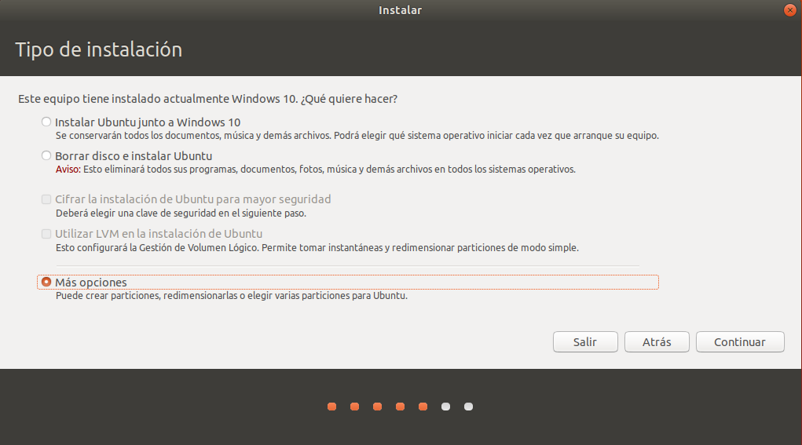
   2. **Sel·lecionar l'espai lliure:** *Per començar comprobem que l'ubuntu detecti les particions de Windows, i que hi ha l'espai lliure i que el podem seleccionar-la*
   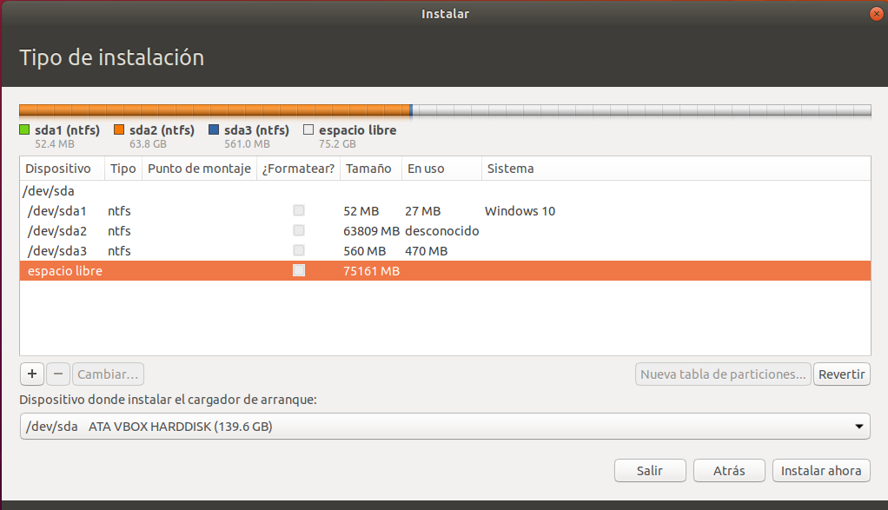
   
   3. **🔹Opciones a usar para tu dual boot**
      1. **Partición raiz /**
         - **Tamaño:** *30720Mb (**30GB**)*
         - **Tip de la nueva particion:** *Logica*
         - **Ubicacnion de la nueva partición:** *Al principio o al final da igual*
         - **Utilzar como:** *Sistema de ficheros EXT4 transaccional de l'angles (**EXT4 journaling file system**)*
         - **Punto de montaje:** *Raiz /*
         - ✅ ok
  
      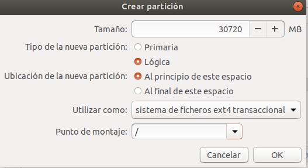

      2. **Particion swap**
         - **Tamaño:** *4096Mb (**4GB** igaul o menor que tu RAM).*
         - **Tipo de la nueva particion:** *Logica*
         - **Ubicacion:** *Per defecte no cal tocar-ho*
         - **Utilizar como:** *Área de intercambio(**SWAP**).*
         - ✅ ok

      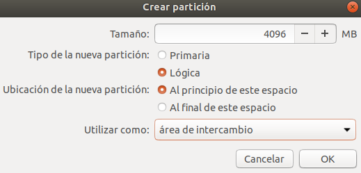

      3. **Particion Home**
        - **Tamaño:** *El resto del espacio libre (**40346MB** o **40,346GB**).*
        - **Tipo de la nueva partición:** *Logica*
        - **Utiliozar como:** */Home*
        -  ✅ ok

      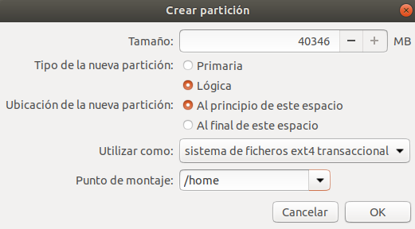

---
### On instal·lar el carregador d'arrancament (GRUB)?
*En la casella **"Dispositivo para la instalación del cargador de arranque"** Selecciona /dev/sda*

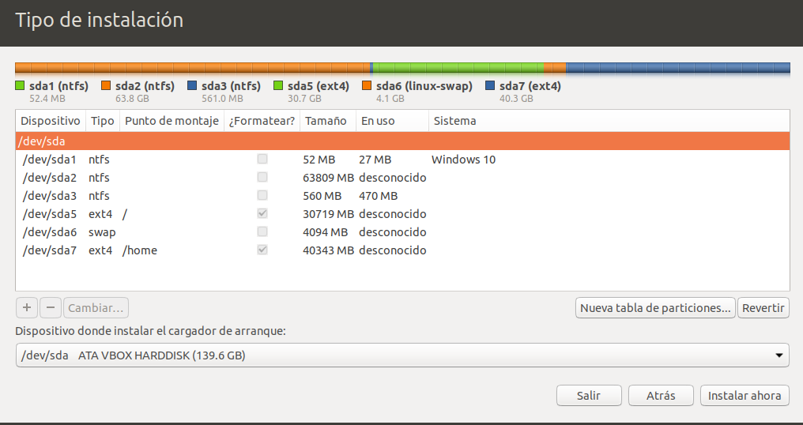

---
### Creacio del perfil

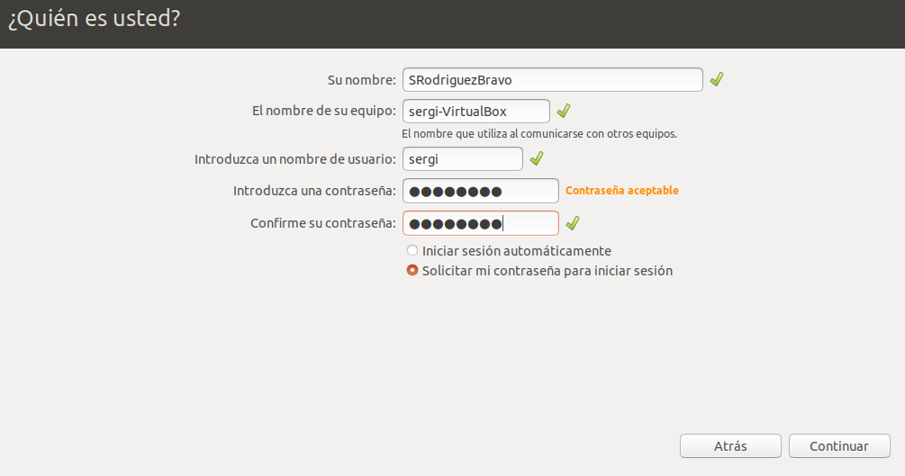

### Finalitzar la instalació 
1. ¿*Terminar la instalació, i treura la iso d'ubuntu*
2. *Reiniciar la maquina*

-----
### 3 Comprovació i pràctiques 
1. **Arrancar en cada sistema:**
   1. *En el Menu GRUB que apareix al arrencar , selecciona:*
      - **Ubuntu:**
   
   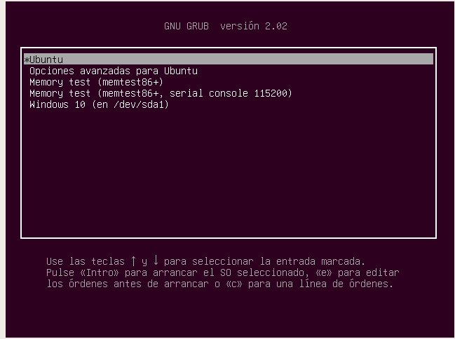

   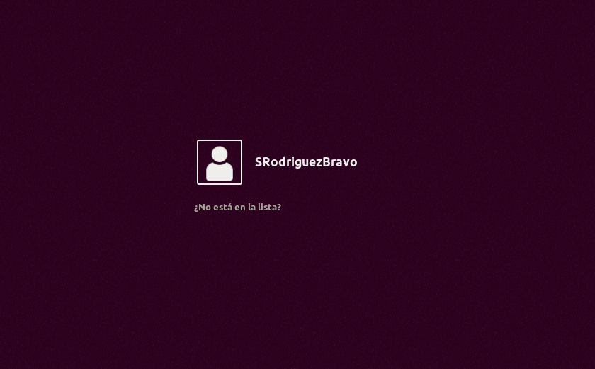

      - **Windows:**

   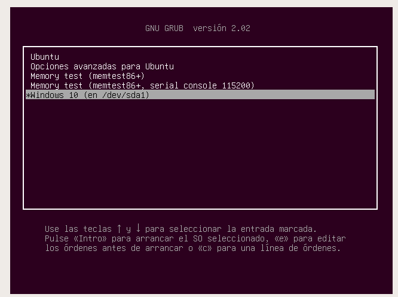

   [](https://youtu.be/Pl6WxC_AFQY)

2. **Actualitzar el Grub:**
   *Per actualitzar el grub, en ubuntu cal obrir un terminal i executar:*
   ```bash
   sudo upadte-grub
   ```
   *Al executaro hauria de sortir el següent:*
   ```bash
   sudo update-grub
   Obteniendo el archivo /etc/default/grub
   Generando un fichero de configuración de grub.
   Encontrada imagen de linux: /boo/vmlinuz #Important vold dir que ha trobat l'ubuntu.
   Encontrada imagen de memoria inicial: /boot/initrd.img
   found memtest86+ image: /boot/memtest86+.elf
   found memtest86+ iamge: /boot/memtest86+.bin
   Encontrado Windows 10 en /dev/sda # La més important perque vol dir que ha detectat Windows a /dev/sda en cas de no detectar-ho mai iniciara windows.
   ```
*Demostració:*

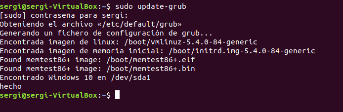


**Que fer si  no hi apareix Encontrado Windows o Found Windows si es en angles?:**

*Instalar os-prober si no esta instalat.*
```bash
sudo apt update
sudo apt install os-prober -y
```
*Mirar la configuracio a /etc/default/grub:*
*Si GRUB_DISABLE_OS_PROBER=true cambiar-ho a false*
*Desprès executa:*
```bash
sudo update-grub
```
3. **Cambiar l'orde amb Grub-customizer:**
*Grub-Customizer no es pot fer servir quan cmabies l'rodre i acutalitzes el cambis el windows desapareix.*
*I he intentat cambiar l'ordre d'arrnacada desde el fitxer /etc/default/grub però no funciona.*

-----
### 4. Reparació del grub:
**Arrenca desde Windows i sobresciru el GRUB, i desprès restaura el GRUB desde un Live USB de Ubuntu.**
1. **Sobrescirure GRUB desde Windows.**
   1. *Insertar l'ISO de Windows 10 i arrencar.*
   2. *Seleccionar idioma → **Reparar el equipo**→ **Solucionar problemas**→ **Símbolo del sistema**:*
   
   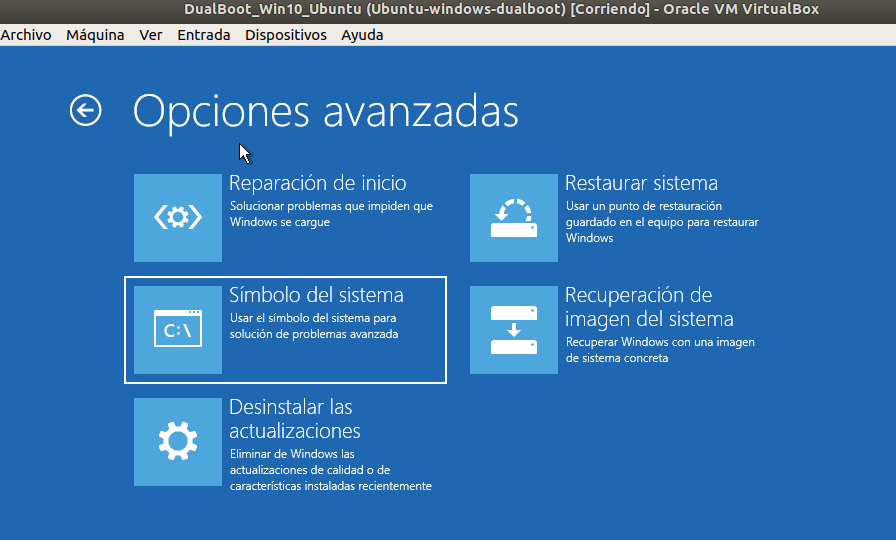

   3. *En el CMD escriure les seguents comandes:*
   ```powershell
   bootrec.exe /fixmbr
   bootrec.exe /scanos
   bootrec.exe /rebuildbcd
   # Encara que he posat bootrec.exe pot ser bootrec hi funciona igual.
   ```
   - **Bootrec /fixmbr:** *Sobrescriu el MBR(treu el GRUB).*

   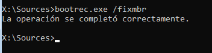

   - **Bootrec /scanos:** *Examina tots els discos en busca d'una instalació de Windows.*
  
  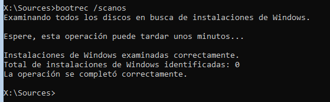

  - **Bootrec /rebuildbcd:** *Reconstrueix la BCD.*
  
  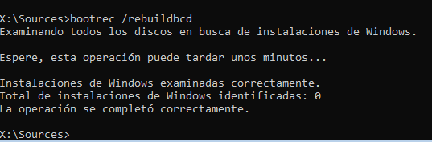
  4. *Reinicar la VM i treura la iso i la mv nomès iniciara en windows 10.*
2. **Restaurar GRUB desde un USB/ISO de Ubuntu:**
   1. *inserir una iso Ubuntu i arrnacar la MV*
   2. *Seleccionar probar ubuntu.*
   3. *Obrir un terminal*
   4. *En el terminal executar les seguents comandes:*
 ```bash
 # 1️⃣ Muntar l'arrel d'ubuntu:
 sudo mount /dev/sda5 /mnt
 # 2️⃣ Muntar /home 
 sudo mount /dev/sda7 /mnt/home
 #  3️⃣ Muntar pseudo-filesystems:
 sudo mount --bind /dev /mnt/dev
 sudo mount --bind /proc /mnt/proc
 sudo mount --bind /sys /mnt/sys
 sudo cp /etc/resolv.conf /mnt/etc/ # Para el DNS dins del chroot.
```

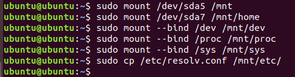

   4. *Ara executem aquestes  comadnes:*
```bash
# 4️⃣ Entrar en chroot:
sudo chroot /mnt
# 5️⃣ Reinstalar GRUB en el MBR del disc:
grub-install /dev/sda
```

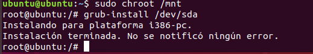

   5. *Ara les següents comandes:*
```bash
# Actualitzar el GRUB.
update-grub
```

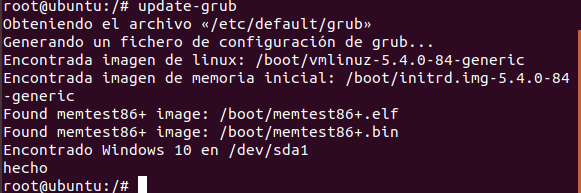

   6. *Comandes per desmuntar les particions*
```bash
# 6️⃣ Per sorti del chroot.
exit
# 7️⃣ Desmontar tot:
sudo ummount /mnt/dev
sudo ummount /mnt/proc
sudo ummount /mnt/sys
sudo ummount /mnt/home
sudo ummount /mnt
# 8️⃣ Reinciar:
sudo reboot
```

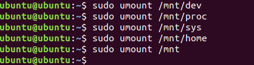


